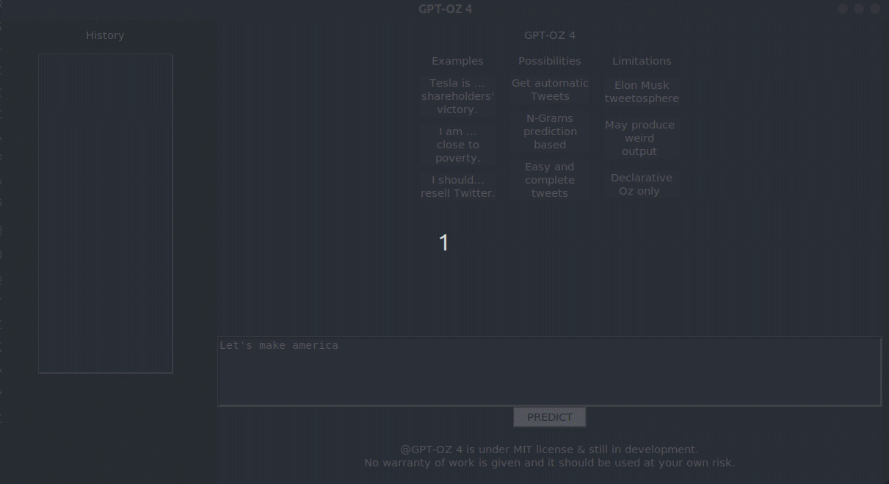

# TwitOZ

Project assignment for LINFO1104!

Uses n-grams to predict the next word in a sequence of words.

## Building

Assuming [Mozart 2](https://github.com/mozart/mozart2) is installed, simply run:

```console
make
```

(This uses GNU Make; use `gmake` on other Unices.)

## Running

Still with GNU Make:

```console
make run
```

## Screenshots



## Extensions
We implementend some more functionnalities to our project:
- We improved the original GUI (made using the Mozart 2 library `QTk`).
- We added an History system which stores the **inputs**
- We use multiple **BT** to compute the next word (one for each n-gram from 1 to 5 words)


## Authors

- Arthur De Neyer (@GaeKo)
- Aymeric Wibo (@obiwac)
